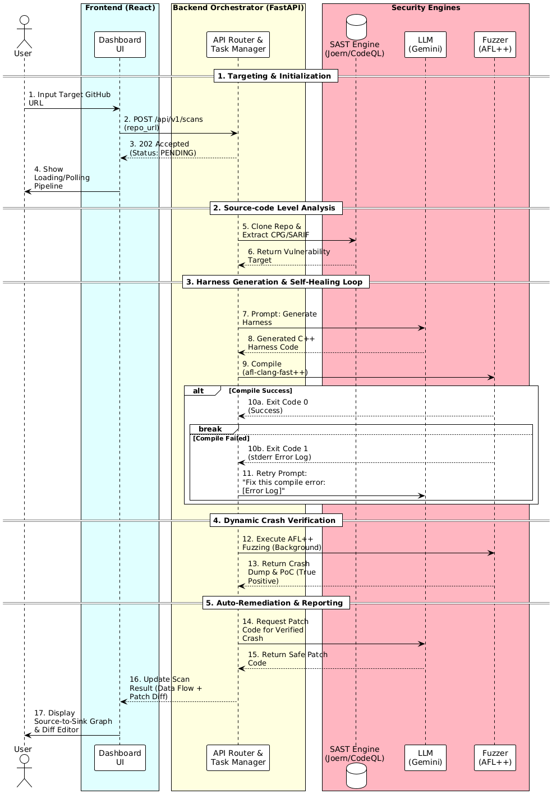

# SmartFuzzQL
SmartFuzzQL은 AI + Fuzzer + CodeQL의 약자로 CodeQL, AFL++ 및 AI-Harness를 이용한 C/C++ 시스템 소프트웨어 자동 보안 취약점 분석 플랫폼입니다.

본 프로젝트는 C/C++ 시스템 소프트웨어의 Memory Corruption Vulnerability을 탐지하고 패치하는 전 과정을 자동화한 End-to-End을 목표로 합니다. 

SAST의 Source-code level analysis 결과를 LLM에 주입하여 Fuzzing Harness를 자동 생성하고, AFL++ 기반의 Native Fuzzer로 실제 Crash를 유발하여 취약점을 Verification합니다.

## Background & Motivation

- **SAST의 한계:** 기존 SAST 도구들은 Source-code level analysis 시 실행 불가능한 경로까지 탐지하여 막대한 False Positive(오탐)를 발생시키며 개발자의 피로도를 높입니다.
- **Fuzzing의 진입 장벽:** Fuzzer가 효율적으로 Crash를 발견하려면 타겟 함수에 맞는 Fuzzing Harness를 작성해야하는 경우가 많은데 이 Fuzzing Harness를 사람이 직접 작성해야 하는 경우 막대한 시간과 비용이 발생합니다.
- **파편화된 워크플로우:** Vulnerability 탐지, Crash 증명, Patch Code 작성 과정이 각각 분리되어 있으며 각 작업을 수행하고 연결하는 작업 비용을 해결하기 위해 효율적인 파이프라인 구축하기로 했습니다.

## Key Features

1. **One-Click Targeting**
   - 대시보드에 GitHub Repository URL을 입력하는 것만으로 전체 분석 파이프라인이 시작됩니다.
2. **SAST Analysis**
   - 백엔드에서 격리된 Docker 컨테이너를 생성하고, Joern/CodeQL을 이용해 Source-code level analysis를 수행합니다.
3. **Harness Generation & Feedback-Loop:**
   - LLM이 Harness 코드를 생성하며, Error 발생 시 컴파일러 로그를 바탕으로 스스로 코드를 수정하는 Feedback Loop를 실행합니다.
6. **Automated Crash Verification**
   - 컴파일된 바이너리를 AFL++로 Fuzzing하여 실제 Crash Dump를 확보하고 취약점을 증명합니다.
7. **Auto-Remediation**
   - 발견된 취약점에 대해 LLM이 안전한 Patch Code를 제안하며, 대시보드에서 원본 코드와 비교해 볼 수 있습니다.

## Pipeline UML
 

## User Interface Overview

- **Project Dashboard (`/dashboard`)**
  - Target Repository 설정 및 Fuzzing Pipeline 실시간 진행 상태 확인
  - 탐지된 Vulnerability의 시각화
- **Admin Dashboard (`/admin/dashboard`)**
  - 분석 요청된 전체 프로젝트 목록 및 결과 조회
- **Vulnerability Report & Diff Viewer (`/report/:id`)**
  - **Left Panel (React Flow):** SAST가 탐지한 Source-to-Sink Data Flow Path를 Node-Edge 형태의 Interactive Graph로 시각화
  - **Right Panel (Monaco Editor):** 원본 Vulnerable Code와 LLM이 제안한 Patch Code를 비교하는 Diff Editor 뷰

## Tech Stack

### Frontend
- React, Tailwind CSS
- React Flow (Data Flow 시각화)
- Monaco Editor (코드 Diff 뷰어)

### Backend & Database
- FastAPI (API Orchestration)
- PostgreSQL (데이터 저장)
- Celery (Background Task 처리)

### Infrastructure & Security Engines
- Docker (컨테이너 격리)
- Joern / CodeQL (SAST)
- Gemini / LLM (Prompt Engineering)
- AFL++ (Fuzzer)

## 👥 Contributors

- **김찬 (Member 1)** - Backend / Infra / Prompt Engineering / SAST Pipeline & AFL++ Environment, Feedback Loop Design
- **윤종현 (Member 2)** - Frontend / Backend / DB Schema & API Orchestration, React Flow / Monaco Editor Integration

## 📚 References
- [AFL++ : Combining Incremental Steps of Fuzzing Research](https://github.com/AFLplusplus/AFLplusplus)
- [GitHub CodeQL Overview](https://codeql.github.com/docs/codeql-overview/about-codeql/)
