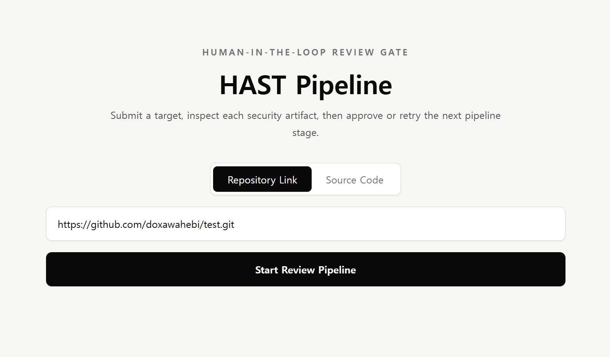
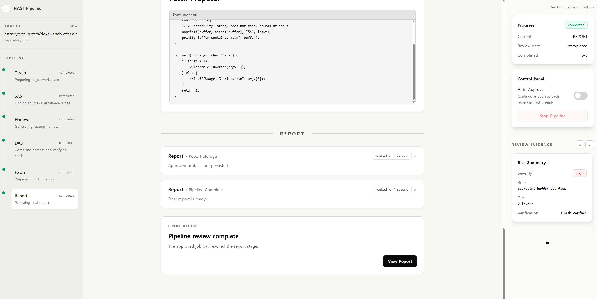
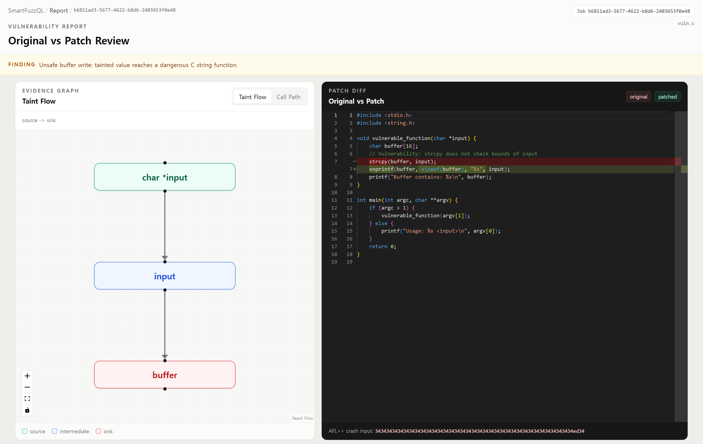
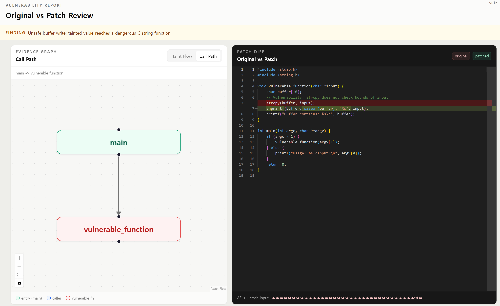

# How To Use

 
repository의 링크를 입력하고 `Start Review Pipeline` 버튼을 누른다.

각 파이프라인의 진행 상황을 확인한 후 모든 과정이 끝나면 `View Report`버튼을 눌러 Reporter를 볼 수 있다.

source to sink형태의 Taint Flow를 볼 수 있다.

함수의 call path를 볼 수 있다.
